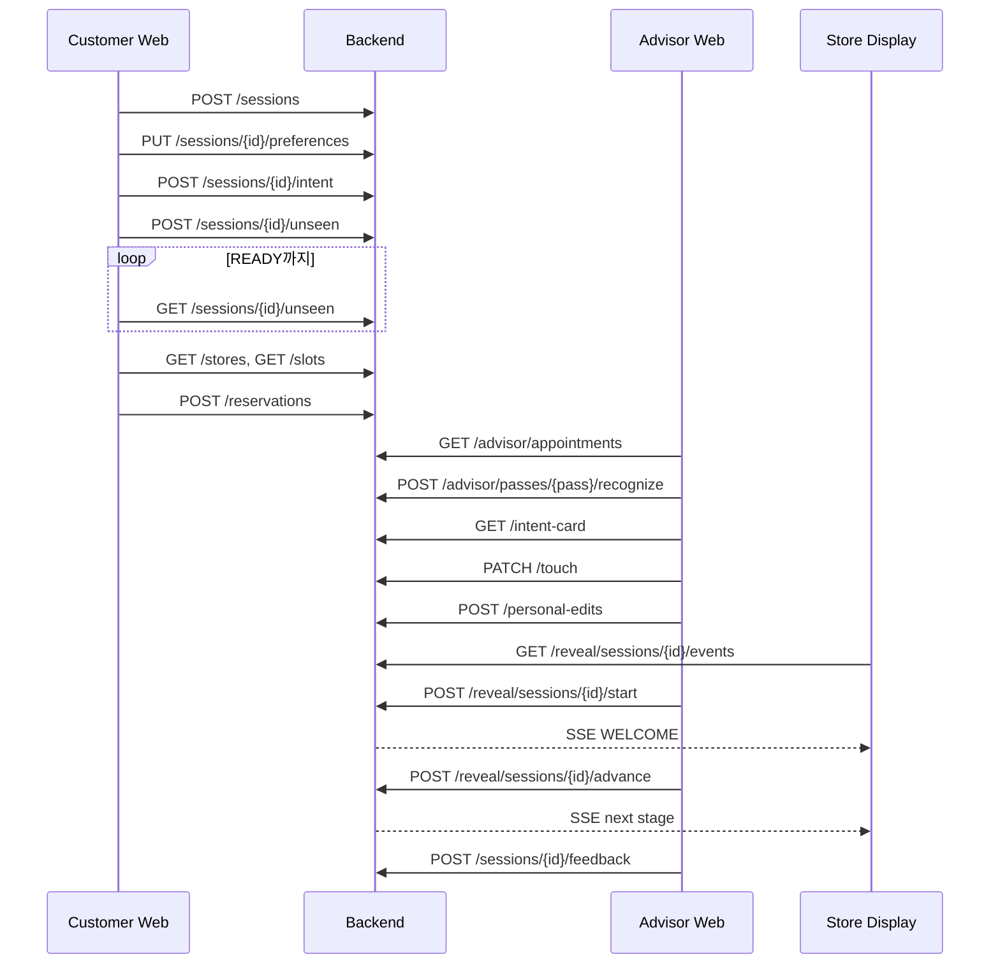

# MCM Re:SENSE API 명세서

현재 `develop` 브랜치의 Spring Boot 구현을 기준으로 작성했습니다.

## 1. 공통 규약

| 항목 | 값 |
|---|---|
| Base URL | `http://localhost:8080/api/v1` |
| Content-Type | `application/json` |
| 인증 | 해커톤 MVP에서는 없음. `demoCustomerId`로 고객 식별 |
| 시간 형식 | ISO-8601, `yyyy-MM-dd'T'HH:mm:ss` |
| UUID | 문자열 UUID |
| SSE | `text/event-stream` |

### 공통 오류 응답

```json
{
  "timestamp": "2026-08-14T05:30:00Z",
  "status": 400,
  "error": "Bad Request",
  "message": "요청값을 확인해 주세요.",
  "path": "/api/v1/sessions",
  "fields": {
    "customerName": "공백일 수 없습니다"
  }
}
```

| HTTP 상태 | 발생 조건 |
|---|---|
| `400 Bad Request` | Bean Validation 실패, 잘못된 파라미터 형식 |
| `404 Not Found` | 세션·예약·매장·PASS·이미지를 찾을 수 없음 |
| `409 Conflict` | 동일 세션 재예약, 동일 매장·시간 중복 예약 |
| `422 Unprocessable Entity` | 현재 Journey 상태에서 수행할 수 없는 요청 |
| `500 Internal Server Error` | 처리되지 않은 서버 오류 |

## 2. API 목록

| 영역 | Method | Path | 설명 |
|---|---|---|---|
| Customer | POST | `/sessions` | 경험 세션 생성 |
| Customer | GET | `/sessions/{sessionId}` | 전체 세션 조회 |
| Input | GET | `/preference-options` | 단계별 선택지 조회 |
| Input | GET | `/sessions/{sessionId}/input-progress` | 입력 진행률/다음 질문 조회 |
| Input | POST | `/sessions/{sessionId}/inputs/choice` | 선택지 한 단계 저장 |
| Input | POST | `/sessions/{sessionId}/inputs/text` | 자유 텍스트 해석·병합 |
| Input | POST | `/sessions/{sessionId}/inputs/voice` | 음성 인식·해석·병합 |
| Input | POST | `/sessions/{sessionId}/preferences/continue` | 이전 동의 세션 취향 이어가기 |
| Customer | PUT | `/sessions/{sessionId}/preferences` | 취향 저장/덮어쓰기 |
| AI | POST | `/sessions/{sessionId}/intent` | Intent Profile 생성 |
| AI | POST | `/sessions/{sessionId}/unseen` | 비동기 UNSEEN 생성 요청 |
| AI | GET | `/sessions/{sessionId}/unseen` | UNSEEN 생성 상태 조회 |
| Reservation | GET | `/stores` | 예약 가능 매장 조회 |
| Reservation | GET | `/stores/{storeId}/slots` | 날짜별 시간 슬롯 조회 |
| Reservation | POST | `/reservations` | 매장 경험 예약 |
| Reservation | GET | `/sessions/{sessionId}/reservation` | 세션 예약 조회 |
| Reservation | PATCH | `/reservations/{reservationId}` | 방문 전 예약 변경 |
| Reservation | DELETE | `/reservations/{reservationId}` | 방문 전 예약 취소 |
| Advisor | GET | `/advisor/appointments` | 날짜별 예약 목록 |
| Advisor | POST | `/advisor/passes/{passCode}/recognize` | PASS 인식/도착 처리 |
| Advisor | GET | `/advisor/sessions/{sessionId}/intent-card` | Intent Card 조회 |
| Advisor | PATCH | `/advisor/sessions/{sessionId}/touch` | 오늘의 우선순위 보정 |
| Advisor | POST | `/advisor/sessions/{sessionId}/personal-edits` | Personal Edit 생성 |
| Advisor | GET | `/advisor/sessions/{sessionId}/personal-edits` | Personal Edit 조회 |
| Reveal | POST | `/reveal/sessions/{sessionId}/start` | Reveal 시작 |
| Reveal | POST | `/reveal/sessions/{sessionId}/advance` | 다음 Reveal 단계 실행 |
| Reveal | GET | `/reveal/sessions/{sessionId}` | 현재 Reveal 상태 조회 |
| Reveal | GET | `/reveal/sessions/{sessionId}/events` | Reveal SSE 구독 |
| Feedback | POST | `/sessions/{sessionId}/feedback` | 구매·피드백 저장 |
| Memory | GET | `/customers/{demoCustomerId}/memory` | 과거 경험 기억 조회 |
| Asset | GET | `/assets/unseen/{unseenId}.svg` | 데모 UNSEEN SVG |
| Asset | GET | `/assets/products/{sku}.svg` | 데모 상품 SVG |

## 3. Customer Journey API

### 3.0 선택지·텍스트·음성 입력

권장 프론트 흐름은 다음과 같습니다.

1. `GET /preference-options`로 7개 단계와 허용값을 조회합니다.
2. 각 선택마다 `POST /sessions/{sessionId}/inputs/choice`를 호출합니다.
3. 응답의 `recommendedTransitionDelayMs` 뒤에 `nextPrompt`를 노출합니다.
4. 사용자가 더 설명하고 싶을 때 텍스트 또는 음성 API를 호출합니다.
5. `readyForIntent=true`이면 Intent 생성을 활성화합니다.

선택 저장 Request:

```json
{
  "step": "CONTEXTS",
  "values": ["Work", "Travel"]
}
```

텍스트 Request:

```json
{
  "text": "부드럽고 넉넉한 코냑 컬러 가방을 출근과 여행에 쓰고 싶어요"
}
```

공통 Response 예시:

```json
{
  "inputMode": "TEXT",
  "transcript": "부드럽고 넉넉한 코냑 컬러 가방을 출근과 여행에 쓰고 싶어요",
  "transcriptionSource": null,
  "extracted": {
    "STRUCTURE": ["Soft"],
    "PROPORTION": ["Spacious"],
    "COLOR": ["Cognac"],
    "CONTEXTS": ["Work", "Travel"]
  },
  "appliedFields": ["STRUCTURE", "PROPORTION", "COLOR", "CONTEXTS"],
  "progress": {
    "completedSteps": 5,
    "totalSteps": 7,
    "percent": 71,
    "nextStep": "ATTITUDE",
    "readyForIntent": false,
    "recommendedTransitionDelayMs": 650,
    "paceMessage": "좋아요. 다음 선택으로 천천히 이어가 볼게요."
  }
}
```

음성 API는 `multipart/form-data`입니다.

| Part/Param | 필수 | 설명 |
|---|---|---|
| `audio` | 조건부 | mp3, mp4, wav, webm, ogg. 최대 15MB |
| `browserTranscript` | 조건부 | 브라우저 Web Speech API가 만든 텍스트. 서버 STT 미설정 시 사용 |
| `language` | 아니오 | 기본값 `ko` |

`audio`와 `browserTranscript` 중 하나는 필요합니다. 서버 STT는 `SPEECH_API_URL`, `SPEECH_API_KEY`, `SPEECH_MODEL`로 설정하며, 제공자 장애 시 transcript가 있으면 자동 대체합니다. 텍스트·음성 해석은 선택지로 이미 채운 값을 덮어쓰지 않습니다.

이전 취향은 `POST /sessions/{sessionId}/preferences/continue`로 이어갑니다. Body를 생략하면 같은 `demoCustomerId`의 최신 동의 세션을 사용하고, 특정 세션을 지정하려면 아래처럼 보냅니다.

```json
{
  "sourceSessionId": "312d2b46-9b17-4930-a0c2-aaf982447166"
}
```

### 3.1 세션 생성

`POST /sessions`

Request:

```json
{
  "demoCustomerId": "demo-lena",
  "customerName": "Lena",
  "phone": "010-1234-5678",
  "email": "lena@example.com",
  "gender": "FEMALE",
  "dataConsent": true
}
```

검증:

- `demoCustomerId`: 필수, 최대 80자
- `customerName`: 필수, 최대 80자
- `phone`: 선택, 최대 30자
- `email`: 선택, 이메일 형식, 최대 160자
- `gender`: 선택, 최대 30자
- `dataConsent`: Boolean

Response: `201 Created`

```json
{
  "sessionId": "312d2b46-9b17-4930-a0c2-aaf982447166",
  "demoCustomerId": "demo-lena",
  "customerName": "Lena",
  "phone": "010-1234-5678",
  "email": "lena@example.com",
  "gender": "FEMALE",
  "dataConsent": true,
  "status": "CREATED",
  "preferences": null,
  "intentProfile": null,
  "unseen": {
    "unseenId": null,
    "status": "NOT_STARTED",
    "imageUrl": null,
    "error": null
  },
  "advisorPriority": null,
  "revealStage": "NOT_STARTED",
  "createdAt": "2026-08-14T05:30:00Z",
  "updatedAt": "2026-08-14T05:30:00Z"
}
```

### 3.2 세션 조회

`GET /sessions/{sessionId}`

Response: `200 OK`, 형식은 세션 생성 응답과 동일하며 현재 취향·Intent·UNSEEN·상태를 모두 포함합니다.

### 3.3 취향 저장

`PUT /sessions/{sessionId}/preferences`

Request:

```json
{
  "silhouette": "Crossbody",
  "structure": "Soft",
  "proportion": "Compact-Spacious",
  "color": "Cognac",
  "attitude": "Quiet",
  "contexts": ["Work", "Travel"],
  "lockedAttribute": "Shape"
}
```

모든 필드는 필수이며 `contexts`는 최소 1개가 필요합니다. 기존 취향을 덮어쓰면 이전 Intent와 UNSEEN 결과는 초기화됩니다.

Response: `200 OK`, 전체 `SessionResponse`, 상태 `PREFERENCES_SAVED`.

### 3.4 Intent Profile 생성

`POST /sessions/{sessionId}/intent`

Request Body: 없음

선행 조건: 취향 저장 완료.

Response: `200 OK`

```json
{
  "purpose": "Work + Travel",
  "priority": "Mobility / Lightweight",
  "style": "Relaxed / Modern",
  "signature": "Soft Structure / Cognac",
  "lockedAttribute": "Shape",
  "concern": "Styling Versatility",
  "summary": "Work Travel 환경을 오가며 사용할 수 있고, Mobility / Lightweight를 우선하면서 Relaxed / Modern의 인상을 유지하는 Soft Structure / Cognac 가방을 원합니다."
}
```

### 3.5 UNSEEN 생성 요청

`POST /sessions/{sessionId}/unseen`

Request Body: 없음

선행 조건: Intent Profile 생성 완료.

Response: `202 Accepted`

```json
{
  "unseenId": "UNSEEN-50256B70",
  "status": "PROCESSING",
  "imageUrl": null,
  "error": null
}
```

트랜잭션 커밋 후 비동기로 생성됩니다. 처리 중 재요청하면 새 작업을 중복 생성하지 않고 현재 상태를 반환합니다.

### 3.6 UNSEEN 상태 조회

`GET /sessions/{sessionId}/unseen`

Response: `200 OK`

```json
{
  "unseenId": "UNSEEN-50256B70",
  "status": "READY",
  "imageUrl": "/assets/unseen/image4.png",
  "error": null
}
```

프론트엔드는 `status`가 `READY` 또는 `FAILED`가 될 때까지 polling할 수 있습니다. 권장 polling 간격은 500~1000ms입니다.
해커톤 모드에서는 제공된 PNG 8개 중 하나를 무작위로 선택해 `imageUrl`에 저장합니다. 같은 세션을 조회하는 동안 선택 결과는 바뀌지 않습니다.

## 4. Reservation API

### 4.1 매장 목록

`GET /stores`

선택 query: `city`. 예: `GET /stores?city=Seoul`. 위치 권한을 받지 못한 경우 query 없이 호출하면 전체 활성 매장을 반환합니다.

Response: `200 OK`

```json
[
  {
    "id": 1,
    "name": "MCM HAUS SEOUL",
    "city": "Seoul",
    "address": "7 Dosan-daero 99-gil, Gangnam-gu"
  }
]
```

### 4.2 시간 슬롯

`GET /stores/{storeId}/slots?date=2026-08-15`

Response: `200 OK`

```json
[
  {
    "date": "2026-08-15",
    "scheduledAt": "2026-08-15T11:00:00",
    "available": true
  }
]
```

매일 11:00~18:00 정각 슬롯을 반환합니다.

### 4.3 예약 생성

`POST /reservations`

Request:

```json
{
  "sessionId": "312d2b46-9b17-4930-a0c2-aaf982447166",
  "storeId": 1,
  "scheduledAt": "2026-08-15T11:00:00"
}
```

검증 및 선행 조건:

- 현재 시각보다 미래여야 함
- UNSEEN 상태가 `READY`여야 함
- 11:00~18:00 정각이어야 함
- 세션당 예약은 1개
- 동일 매장·동일 시간 중복 불가

Response: `201 Created`

```json
{
  "reservationId": "ad0a8c81-f873-4fc4-a573-48c956295edd",
  "sessionId": "312d2b46-9b17-4930-a0c2-aaf982447166",
  "storeId": 1,
  "storeName": "MCM HAUS SEOUL",
  "scheduledAt": "2026-08-15T11:00:00",
  "status": "BOOKED",
  "passCode": "PASS-82D1FC80"
}
```

### 4.4 세션 예약 조회

`GET /sessions/{sessionId}/reservation`

Response: `200 OK`, 예약 생성 응답과 동일합니다.

## 5. Advisor API

### 5.1 예약 목록

`GET /advisor/appointments?date=2026-08-15&storeId=1`

- `date`: 선택. 없으면 서버 기준 오늘
- `storeId`: 선택. 없으면 전 매장

Response: `200 OK`

```json
[
  {
    "reservation": {
      "reservationId": "ad0a8c81-f873-4fc4-a573-48c956295edd",
      "sessionId": "312d2b46-9b17-4930-a0c2-aaf982447166",
      "storeId": 1,
      "storeName": "MCM HAUS SEOUL",
      "scheduledAt": "2026-08-15T11:00:00",
      "status": "BOOKED",
      "passCode": "PASS-82D1FC80"
    },
    "customerName": "Lena",
    "unseenId": "UNSEEN-50256B70",
    "intentSummary": "Work와 Travel을 오가며 사용할 수 있는 가방을 원합니다."
  }
]
```

### 5.2 PASS 인식

`POST /advisor/passes/{passCode}/recognize`

Request Body: 없음

Response: `200 OK`

```json
{
  "recognized": true,
  "sessionId": "312d2b46-9b17-4930-a0c2-aaf982447166",
  "customerName": "Lena",
  "unseenId": "UNSEEN-50256B70",
  "reservation": {
    "reservationId": "ad0a8c81-f873-4fc4-a573-48c956295edd",
    "sessionId": "312d2b46-9b17-4930-a0c2-aaf982447166",
    "storeId": 1,
    "storeName": "MCM HAUS SEOUL",
    "scheduledAt": "2026-08-15T11:00:00",
    "status": "ARRIVED",
    "passCode": "PASS-82D1FC80"
  }
}
```

### 5.3 Intent Card

`GET /advisor/sessions/{sessionId}/intent-card`

Response: `200 OK`

```json
{
  "sessionId": "312d2b46-9b17-4930-a0c2-aaf982447166",
  "customerName": "Lena",
  "unseenId": "UNSEEN-50256B70",
  "unseenImageUrl": "/api/v1/assets/unseen/UNSEEN-50256B70.svg",
  "intentProfile": {
    "purpose": "Work + Travel",
    "priority": "Mobility / Lightweight",
    "style": "Relaxed / Modern",
    "signature": "Soft Structure / Cognac",
    "lockedAttribute": "Shape",
    "concern": "Styling Versatility",
    "summary": "Work와 Travel을 오가며 사용할 수 있는 가방을 원합니다."
  },
  "advisorPriority": null,
  "reservation": {}
}
```

`reservation`은 4.3의 `ReservationResponse` 형식입니다.

### 5.4 Advisor Touch

`PATCH /advisor/sessions/{sessionId}/touch`

Request:

```json
{
  "priority": "Styling"
}
```

`priority`는 필수이며 최대 100자입니다.

Response: `200 OK`, 갱신된 `IntentCardResponse`.

### 5.5 Personal Edit 생성

`POST /advisor/sessions/{sessionId}/personal-edits`

Request Body: 없음

선행 조건: Intent Profile 존재, 사용 가능한 더미 상품 3개 이상.

동일 세션에서 재호출하면 기존 Edit을 삭제하고 3개를 다시 생성합니다.

Response: `200 OK`

```json
{
  "sessionId": "312d2b46-9b17-4930-a0c2-aaf982447166",
  "edits": [
    {
      "editId": "a58fbf58-7472-4772-ae21-52c6d6eeac26",
      "direction": "THE_EVERYDAY",
      "productId": 1,
      "sku": "MCM-DEMO-001",
      "productName": "Soft Diamond Crossbody",
      "productImageUrl": "/api/v1/assets/products/MCM-DEMO-001.svg",
      "strap": "Classic short leather strap",
      "accessory": "Minimal keyring",
      "rationale": "Soft Structure / Cognac와 일상 활용성을 중심으로 가장 자연스러운 구성을 준비했습니다."
    }
  ]
}
```

실제 응답의 `edits`에는 `THE_EVERYDAY`, `THE_NOMAD`, `THE_UNEXPECTED`가 각각 1개씩 포함됩니다.

### 5.6 Personal Edit 조회

`GET /advisor/sessions/{sessionId}/personal-edits`

Response: `200 OK`, 5.5와 동일한 `PersonalEditResponse`.

## 6. Store Reveal API

### 6.1 SSE 구독

`GET /reveal/sessions/{sessionId}/events`

Response Content-Type: `text/event-stream`

이벤트 이름: `reveal-state`

```text
event:reveal-state
data:{"sessionId":"312d2b46-9b17-4930-a0c2-aaf982447166","stage":"WELCOME","sessionStatus":"REVEALING"}
```

구독 직후 현재 상태를 즉시 한 번 전송합니다. `COMPLETED` 이벤트 전송 후 서버가 emitter를 완료합니다. 프론트엔드는 Reveal 화면 진입 시 먼저 SSE를 연결한 뒤 Advisor의 Start 요청을 기다리는 방식을 권장합니다.

### 6.2 Reveal 시작

`POST /reveal/sessions/{sessionId}/start`

선행 조건: UNSEEN ID 존재.

Response: `200 OK`

```json
{
  "sessionId": "312d2b46-9b17-4930-a0c2-aaf982447166",
  "stage": "WELCOME",
  "sessionStatus": "REVEALING"
}
```

### 6.3 다음 단계

`POST /reveal/sessions/{sessionId}/advance`

단계 순서:

`WELCOME → UNSEEN_REVEAL → LIFESTYLE_SCENE → FINAL_TRANSITION → COMPLETED`

Response: `200 OK`, 변경된 `RevealResponse`. 연결된 SSE 클라이언트에도 같은 상태를 발행합니다.

### 6.4 Reveal 상태 조회

`GET /reveal/sessions/{sessionId}`

Response: `200 OK`, 현재 `RevealResponse`.

## 7. Feedback & Memory API

### 7.1 피드백 저장

`POST /sessions/{sessionId}/feedback`

Request:

```json
{
  "loved": ["Shape", "Styling"],
  "concerns": ["Weight"],
  "wants": ["Smaller Size"],
  "result": "NOT_PURCHASED",
  "purchasedProductId": null
}
```

- `loved`, `concerns`, `wants`: 선택 배열. 항목이 있다면 빈 문자열 불가
- `result`: 필수, `PURCHASED`, `NOT_PURCHASED`, `UNDECIDED`
- `purchasedProductId`: 구매한 경우 사용할 상품 ID. 현재 논리 참조

Response: `200 OK`

```json
{
  "sessionId": "312d2b46-9b17-4930-a0c2-aaf982447166",
  "result": "NOT_PURCHASED",
  "status": "COMPLETED"
}
```

### 7.2 고객 Memory

`GET /customers/{demoCustomerId}/memory`

Response: `200 OK`

```json
{
  "demoCustomerId": "demo-lena",
  "experiences": [
    {
      "sessionId": "312d2b46-9b17-4930-a0c2-aaf982447166",
      "unseenId": "UNSEEN-50256B70",
      "intentSummary": "Work와 Travel을 오가며 사용할 수 있는 가방을 원합니다.",
      "loved": ["Shape", "Styling"],
      "concerns": ["Weight"],
      "wants": ["Smaller Size"],
      "result": "NOT_PURCHASED",
      "experiencedAt": "2026-08-14T05:45:00Z"
    }
  ]
}
```

피드백이 저장된 세션만 최신순으로 반환합니다.

## 8. Asset API

### 8.1 UNSEEN 이미지

`GET /assets/unseen/{unseenId}.svg`

Response: `200 OK`, Content-Type `image/svg+xml;charset=UTF-8`.

이 엔드포인트는 랜덤 이미지 목록이 비어 있을 때 사용하는 SVG fallback입니다. 기본 해커톤 설정에서는 `/assets/unseen/image.png`부터 `image8.png`까지의 정적 PNG가 반환됩니다.

### 8.2 상품 이미지

`GET /assets/products/{sku}.svg`

Response: `200 OK`, Content-Type `image/svg+xml;charset=UTF-8`.

## 9. 프론트엔드 권장 호출 흐름



## 10. CORS

기본 허용 Origin:

- `http://localhost:3000`
- `http://localhost:5173`

배포 환경에서는 `CORS_ALLOWED_ORIGINS` 환경변수에 쉼표로 구분해 지정합니다.
