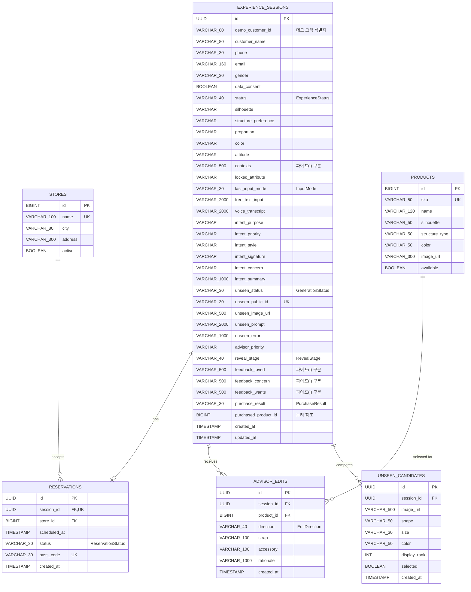
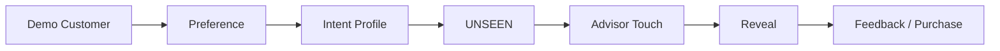
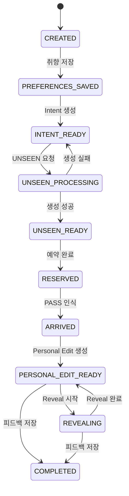

# MCM Re:SENSE ERD

이 문서는 현재 `main` 브랜치에 구현된 JPA 엔티티를 기준으로 작성되었습니다.

## 1. 전체 ERD

## 2. 관계와 제약조건

| 부모 | 자식 | 관계 | 구현 규칙 |
|---|---|---|---|
| `experience_sessions` | `reservations` | 1 : 0..1 | `reservations.session_id`가 Unique이므로 세션당 예약은 최대 1개입니다. |
| `stores` | `reservations` | 1 : N | 한 매장은 여러 예약을 받습니다. |
| `experience_sessions` | `advisor_edits` | 1 : N | 세션당 기본 3개 Personal Edit을 생성합니다. |
| `products` | `advisor_edits` | 1 : N | 하나의 상품이 여러 고객 세션의 Edit에 사용될 수 있습니다. |
| `experience_sessions` | `unseen_candidates` | 1 : N | 세션마다 최대 4개 결과 후보를 만들며 `(session_id, display_rank)`는 Unique입니다. |

예약 테이블에는 `(store_id, scheduled_at, status)` 복합 Unique 제약조건 `uk_store_schedule_status`가 적용됩니다. 활성 예약 중복은 서비스 계층에서도 차단하며, 취소된 슬롯은 다시 예약할 수 있습니다.

`experience_sessions.purchased_product_id`는 현재 해커톤 MVP에서 논리 참조값으로만 저장되며 실제 외래키는 아닙니다. 실제 운영 전환 시 `products.id` 외래키로 변경하는 것을 권장합니다.

## 3. 세션 애그리거트

현재 구현은 해커톤에서 End-to-End 흐름을 빠르게 연결하기 위해 다음 정보를 `experience_sessions` 하나에 모았습니다.

- 고객: `demo_customer_id`, `customer_name`, 선택 프로필(`phone`, `email`, `gender`), `data_consent`
- 취향: `silhouette`부터 `locked_attribute`까지
- 입력 이력: 마지막 입력 모드, 자유 텍스트, 음성 transcript
- Intent Profile: `intent_purpose`부터 `intent_summary`까지
- UNSEEN: `unseen_status`, `unseen_public_id`, 최종 이미지·프롬프트·오류와 `unseen_candidates` 최대 4개
- 오프라인: `advisor_priority`, `reveal_stage`
- 기억: Loved, Concern, Wants, 구매 결과

`contexts`, `feedback_loved`, `feedback_concern`, `feedback_wants`는 현재 파이프 문자(`|`)로 구분해 저장하고 API에서는 배열로 변환합니다.

## 4. 상태 정의

### ExperienceStatus

값:

- `CREATED`
- `PREFERENCES_SAVED`
- `INTENT_READY`
- `UNSEEN_PROCESSING`
- `UNSEEN_READY`
- `RESERVED`
- `ARRIVED`
- `PERSONAL_EDIT_READY`
- `REVEALING`
- `COMPLETED`

### GenerationStatus

- `NOT_STARTED`
- `PROCESSING`
- `READY`
- `FAILED`

### ReservationStatus

- `BOOKED`
- `ARRIVED`
- `COMPLETED`
- `CANCELLED`

### RevealStage

`NOT_STARTED → WELCOME → UNSEEN_REVEAL → LIFESTYLE_SCENE → FINAL_TRANSITION → COMPLETED`

### PurchaseResult

- `PURCHASED`
- `NOT_PURCHASED`
- `UNDECIDED`

### EditDirection

- `THE_EVERYDAY`
- `THE_NOMAD`
- `THE_UNEXPECTED`

## 5. 운영 전환 시 권장 정규화

MVP 이후에는 다음 테이블 분리를 권장합니다.

1. `customers`, `customer_consents`: 실제 회원·동의 이력
2. `session_preferences`, `session_contexts`: 취향 및 다중 Context
3. `intent_profiles`: AI 모델·프롬프트 버전과 생성 이력
4. `unseens`: 현재 `unseen_candidates`를 포함한 재생성·선택 이력 상위 애그리거트
5. `feedback_items`: Loved, Concern, Wants 항목별 분석
6. `inventory`: 매장별 실제 재고와 이동 상태
7. `reveal_events`: Reveal 실행·단계별 이벤트 로그

현재 구조는 standalone 해커톤 데모에는 충분하며, 위 분리는 CRM·실재고·분석 기능을 도입할 때 적용하면 됩니다.
